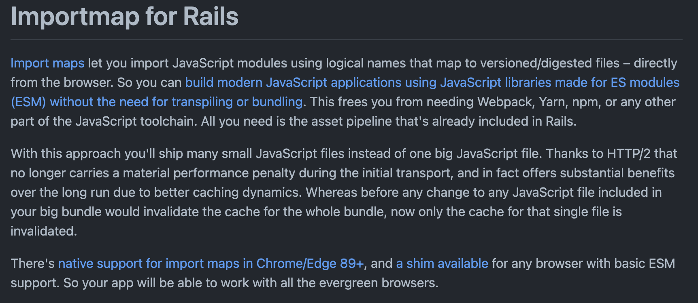

# Import Maps

```html
<script type="importmap">
{
  "imports": {
    "moment": "/node_modules/moment/src/moment.js",
    "lodash": "/node_modules/lodash-es/lodash.js"
  }
}
</script>
```

----
<!-- .slide: data-auto-animate -->
# Conversion

```html
<script type="module">
import moment from "moment";
import { partition } from "lodash";
</script>
```

----

<!-- .slide: data-auto-animate -->
# Conversion

```html
<script type="module">
import moment from "/node_modules/moment/src/moment.js";
import { partition } from "/node_modules/lodash-es/lodash.js";
</script>
```

---


----

# importmap-rails

https://github.com/rails/importmap-rails

---



----

# Commands

<pre><code style="font-size: 18px;">
./bin/importmap pin react react-dom
Pinning "react" to https://ga.jspm.io/npm:react@17.0.2/index.js
Pinning "react-dom" to https://ga.jspm.io/npm:react-dom@17.0.2/index.js
Pinning "object-assign" to https://ga.jspm.io/npm:object-assign@4.1.1/index.js
Pinning "scheduler" to https://ga.jspm.io/npm:scheduler@0.20.2/index.js
</code></pre>

----

<pre><code style="font-size: 18px;">
./bin/importmap json

{
  "imports": {
    "application": "/assets/application-37f365cbecf1fa2810a8303f.js",
    "react": "https://ga.jspm.io/npm:react@17.0.2/index.js",
    "react-dom": "https://ga.jspm.io/npm:react-dom@17.0.2/index.js",
    "object-assign": "https://ga.jspm.io/npm:object-assign@4.1.1/index.js",
    "scheduler": "https://ga.jspm.io/npm:scheduler@0.20.2/index.js"
  }
}
</code></pre>

----

# more commands

```sh
./bin/importmap unpin react
./bin/importmap pin react --env development
./bin/importmap pin react --from jsdelivr
./bin/importmap pin react --download
./bin/importmap unpin react --download
```

---

For more info please visit:
https://github.com/rails/importmap-rails

---

# Let's focus on import-maps itself

---

## Trailing splash

```js
{
  "imports": {
    "moment": "/node_modules/moment/src/moment.js",
    "moment/": "/node_modules/moment/src/",
    "lodash": "/node_modules/lodash-es/lodash.js",
    "lodash/": "/node_modules/lodash-es/"
  }
}
```

```js
import localeData from "moment/locale/zh-cn.js";
import fp from "lodash/fp.js";
```

---

## URL-like specifier remapping

```js
{
  "imports": {
    "/app/helpers.mjs": "/app/helpers/index.mjs"
  }
}
```

---

## URL to local file

```js
{
  "imports": {
    "https://www.unpkg.com/vue/": "/node_modules/vue/"
  }
}
```

---

## for CDN

```js
{
  "imports": {
    "/js/app.mjs": "/js/app-8e0d62a03.mjs",
    "/js/dep.mjs": "/js/dep-16f9d819a.mjs",
    "/js/sub-dep.mjs": "/js/sub-dep-7be2aa47f.mjs"
  }
}
```

---

## Fallback

<pre><code data-line-numbers="4-5" style="font-size: 18px;">{
  "imports": {
    "jquery": [
      "https://ajax.googleapis.com/ajax/libs/jquery/3.3.1/jquery.min.js",
      "/node_modules/jquery/dist/jquery.js"
    ]
  }
}
</code></pre>

---

## Make Mapping works

#### not work
```js
<script src="./app.mjs">
<link rel="modulepreload" href="./app.mjs">
```

#### works
```js
<script type="module" src="./app.mjs"></>
<script type="module">import "./app.mjs";</script>
```

---

## Scope

Support multiple versions of the same package

<pre><code data-line-numbers="3,7" style="font-size: 16px;">{
  "imports": {
    "querystringify": "/node_modules/querystringify/index.js"
  },
  "scopes": {
    "/node_modules/socksjs-client/": {
      "querystringify": "/node_modules/socksjs-client/querystringify/index.js"
    }
  }
}
</code></pre>

---

## Way to Reject

<pre><code data-line-numbers="3,7" style="font-size: 16px;">{
  "imports": {
    "querystringify": null
  },
  "scopes": {
    "/node_modules/socksjs-client/": {
      "querystringify": "/node_modules/socksjs-client/querystringify/index.js"
    }
  }
}
</code></pre>

---

## Preload

https://developer.chrome.com/blog/modulepreload/

```
<link rel="modulepreload" href="vendor.js">
```

---

# References:

- https://github.com/WICG/import-maps
- https://developer.chrome.com/blog/modulepreload/
- https://github.com/rails/importmap-rails
- https://www.jianshu.com/p/b23d823a183a

---
# The End
